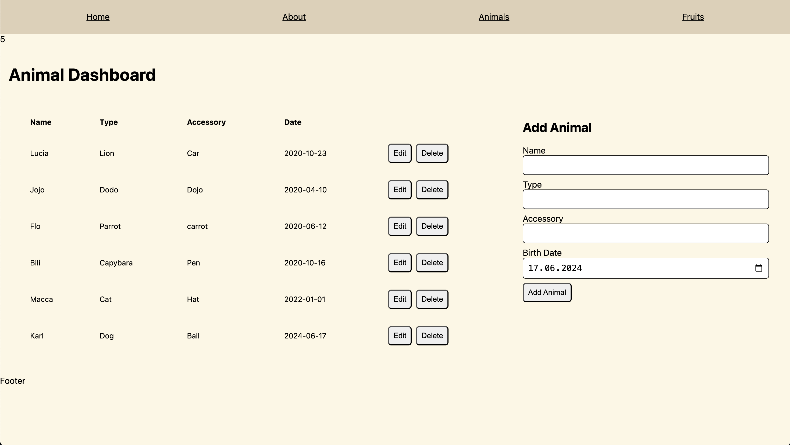

# UpLeveled Next.js example - Spring 2024

The Next.js example - Spring 2024 is a project that demonstrates how to use Next.js to build a full-stack web application. It is part of the curriculum for the [UpLeveled Fullstack Web Development Bootcamp](https://upleveled.io/web-development-bootcamp).




## Technologies

- Next.js
- Postgres.js
- Jest
- Playwright

## Database Setup

If you don't have PostgreSQL installed yet, follow the instructions from the PostgreSQL step in [UpLeveled's System Setup Instructions](https://github.com/upleveled/system-setup/blob/master/readme.md).

Copy the `.env.example` file to a new file called `.env` (ignored from Git) and fill in the necessary information.

Then, connect to the built-in `postgres` database as administrator in order to create the database:

**Windows**

If it asks for a password, use `postgres`.

```bash
psql -U postgres
```

**macOS**

```bash
psql postgres
```

**Linux**

```bash
sudo -u postgres psql
```

Once you have connected, run the following to create the database:

```sql
CREATE DATABASE <database name>;
CREATE USER <user name> WITH ENCRYPTED PASSWORD '<user password>';
GRANT ALL PRIVILEGES ON DATABASE <database name> TO <user name>;
\connect <database name>
CREATE SCHEMA <schema name> AUTHORIZATION <user name>;
```

Quit `psql` using the following command:

```bash
\q
```

On Linux, it is [best practice to create an operating system user for each database](https://docs.redhat.com/en/documentation/red_hat_enterprise_linux/9/html/configuring_and_using_database_servers/using-postgresql_configuring-and-using-database-servers#con_postgresql-users_using-postgresql), to ensure that the operating system user can only access the single database and no other system resources. A different password is needed on Linux because [passwords of operating system users cannot contain the user name](https://github.com/upleveled/system-setup/issues/74). First, generate a random password and copy it:

```bash
openssl rand -hex 16
```

Then create the user, using the database user name from the previous section above. When you are prompted to create a password for the user, paste in the generated password.

```bash
sudo adduser <user name>
```

Once you're ready to use the new user, reconnect using the following command.

**Windows and macOS:**

```bash
psql -U <user name> <database name>
```

**Linux:**

```bash
sudo -u <user name> psql -U <user name> <database name>
```

## Run Tests

To run unit tests with Jest, use the following command:

```bash
pnpm jest
```

To run end-to-end tests with Playwright, use the following command:

```bash
pnpm playwright test
```

## Deployment

- Fly.io
- Docker

## Authentication

Some pages are protected with sessions and can only be accessed by authenticated users. User needs to login with username and password to be authenticated. Authenticated users can access the protected pages and perform CRUD operations on the animals.

```
export type User = {
  id: number;
  username: string;
};

export type UserWithPasswordHash = User & {
  passwordHash: string;
};

type Error = {
  message: string;
};

```

```
- /api/(auth)/register
  - POST   => User   | Error[]   (create user)

- /api/(auth)/login
  - POST   => User   | Error[]   (login user)
```
